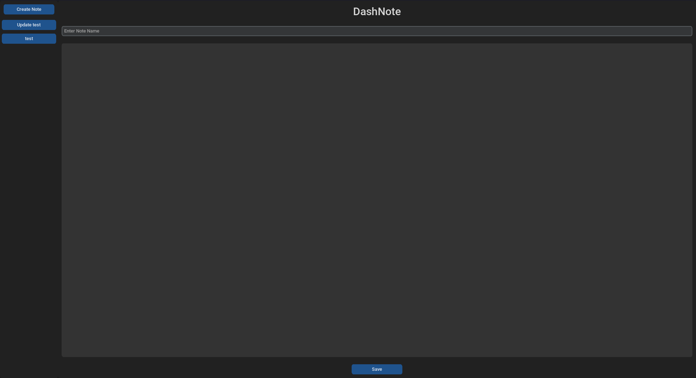

DashNote

DashNote
========

DashNote is a simple note-taking application built using customtkinter. It allows you to create, save, and update notes with a user-friendly interface.

Features
--------

*   Dark theme for comfortable usage.
*   Create new notes with a specified name.
*   Save notes with automatic storage in a "saved-notes" folder.
*   Update existing notes with ease.
*   Left panel displays the history of saved notes.

Requirements
------------

*   Python 3.x
*   customtkinter library

Usage
-----

1. Ensure the customtkinter library is installed:
   `pip install -r requirements.txt`
2.  Run the script using Python:
`python3 dashnote.py`
3.  The application window will open with the title "DashNote" and a left panel for note history.
4.  Click "Create Note" to create a new note. Enter the note name and content, then click "Save."
5.  Existing notes are displayed on the left panel. Click on a note name to load its content into the text editor.
6.  To update a note, click on the note name, make changes, and click "Update."

File Structure
--------------

*   `saved-notes/`: Folder to store saved notes in text files.

Author
------

[Arwin Kumar](https://arwindpianist.github.io/)

License
-------

This project is licensed under the MIT License - see the [LICENSE](LICENSE) file for details.